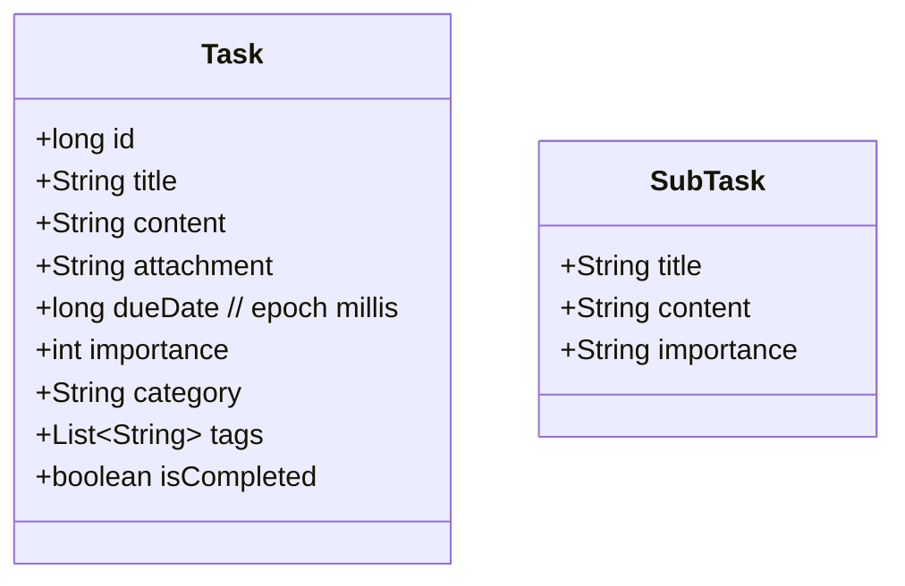

# TodoList Android 应用 设计文档

## 1. 概览
- **平台**: Android (Java, AppCompat, Material)
- **最低/目标/编译 SDK**: minSdk 26 / targetSdk 35 / compileSdk 35
- **包名/应用ID**: `com.xuhuanxuan.todolist`
- **主要功能**:
  - 任务管理（新增、编辑、删除、查看详情）
  - 今日任务与日历视图
  - 启动时提醒历史未完成任务，支持批量操作：移至今日/标记完成
  - AI 助手对话（Moonshot Kimi API）
- **数据存储**: 内置 SQLite（`SQLiteOpenHelper` 手写 DAO，非 Room）
- **网络**: Retrofit2 + OkHttp3 + GsonConverter

## 2. 架构与模块
本项目采用单模块 `:app`，以 Activity + Fragment 组合实现三 Tab 导航。状态主要保存在 `DatabaseHelper` 与页面内内存中，无全局依赖注入/状态管理框架。

- `MainActivity`
  - 承载底部导航 `BottomNavigationView`，在 `fragmentContainer` 动态切换 Fragment。
  - 首次启动时通过 `DatabaseHelper#getIncompleteTasks` 拉取历史未完成任务，弹出多选对话框，批量执行：
    - `updateTasksDueDate` 将任务截止时间批量更新为今早 08:00。
    - `markTasksAsCompleted` 批量标记完成。
  - 提供 `refreshHomeFragmentTasks()` 回调刷新首页任务列表。

- Tab1：任务列表与详情（`tab1/`）
  - `HomeFragment`：展示当天任务；与 `TaskAdapter` 协作。
  - `AddTaskActivity` / `EditTaskActivity`：创建/更新任务。
  - `TaskDetailActivity`：查看任务详情。

- Tab2：日历（`tab2/`）
  - `CalendarFragment` / `MonthFragment` / `MonthPagerAdapter` / `CalendarAdapter`：月份分页与每日任务数量渲染。
  - `TaskDayActivity` / `TaskDayAdapter`：某日的任务清单。

- Tab3：AI 聊天（`tab3/`）
  - `AiFragment`：RecyclerView 聊天界面，发送后调用 `KimiApiService`。
  - `RetrofitInstance`：集中配置 BaseUrl、日志拦截器与 Gson 转换。
  - `KimiApiService`：定义 `POST /v1/chat/completions` 接口与请求/响应模型。

- 数据模型（`dataclass/`）
  - `Task`：包含 id、title、content、attachment、dueDate、importance、category、tags（字符串列表）、isCompleted。
  - `SubTask`：用于日视图列表的轻量条目（title、content、importance）。
  - `CalendarDay`：日历单元数据。

- 数据访问 `utils/DatabaseHelper`
  - 维护本地 SQLite 表 `tasks`；所有字段均直接映射。
  - 提供 CRUD 与查询：`getAllTasks`、`getTodayTasks`、`getIncompleteTasks`、`getTaskById`、`getTitlesByDate`、`getTitlesAndContentsByDate`、`updateTask`、`deleteTask`、批量操作（更新 dueDate、批量完成）。

## 3. 关键数据结构


- SQLite 表 `tasks`
  - `id INTEGER PRIMARY KEY AUTOINCREMENT`
  - `title TEXT`
  - `content TEXT`
  - `attachment TEXT`
  - `dueDate INTEGER`（毫秒时间戳）
  - `importance INTEGER`
  - `category TEXT`
  - `tags TEXT`（以逗号分隔存储）
  - `isCompleted INTEGER`（0/1）

## 4. 主要流程
- 启动流程
  1. `MainActivity#onCreate` 设置布局与导航。
  2. 首次启动：`DatabaseHelper#getIncompleteTasks()` → 弹出对话框 → 用户选择：
     - 移至今日：`updateTasksDueDate(selected)`（今天 08:00 毫秒）→ `HomeFragment.freshTasks()` 刷新。
     - 标记完成：`markTasksAsCompleted(selected)` → 刷新。

- 首页（当天任务）
  - `HomeFragment` 调用 `DatabaseHelper#getTodayTasks()` 渲染；列表交互进入详情或编辑。

- 日历
  - `CalendarFragment` 分页月份，点击某日进入 `TaskDayActivity`，使用 `getTitlesAndContentsByDate(dateMillis)` 加载。

- AI 对话
  - `AiFragment`：构造 messages（system + user），调用 `KimiApiService#getChatResponse`，回调中追加机器人回复到 RecyclerView。

## 5. 依赖与版本
- AppCompat `1.7.1`、Material `1.13.0`
- Retrofit `2.9.0`、OkHttp `4.9.1`、Gson Converter
- JUnit/Espresso 用于测试依赖占位

## 6. 工程结构
```
app/
  src/main/
    java/com/xuhuanxuan/todolist/
      dataclass/
      tab1/
      tab2/
      tab3/
      utils/DatabaseHelper.java
    res/
    AndroidManifest.xml
  build.gradle.kts
```

## 7. 非功能性设计
- **本地存储**：SQLite 单表，读写均在主线程调用点触发（建议后续切换到异步/Room）。
- **网络**：统一 `RetrofitInstance`，附带 HttpLoggingInterceptor（BODY 级别，调试友好但生产需下调）。
- **UI/UX**：Material 组件 + BottomNavigation 三分区导航。
- **国际化**：以中文字符串为主，可扩展 `values-xx`。

## 8. 安全与合规建议
- 移除硬编码 API Key：`tab3/KimiApiService` 使用了 `@Headers("Authorization: Bearer ...")` 硬编码密钥。
  - 建议：
    - 使用 OkHttp Interceptor 从安全存储（`EncryptedSharedPreferences` 或本地调试用 `local.properties`/CI Secrets）注入 `Authorization` 头；
    - 调试环境可用 Gradle 构建变量注入（`buildConfigField`），提交前移除明文；
    - 对提交历史进行密钥吊销与重置。
- 日志级别：生产环境禁用 BODY 级别日志，避免泄露请求/响应内容。
- 数据合规：任务内容可能包含个人信息，应避免未经授权外发到第三方接口；AI Tab 可增加用户确认开关。

## 9. 性能与稳定性
- 数据库访问建议移至后台线程，避免 UI 卡顿。
- 列表使用 `RecyclerView` 与轻量 `SubTask` 减小绑定开销。
- `getTodayTasks`/`getIncompleteTasks` 使用 `strftime` 进行日期过滤，注意索引与查询效率（可改为起止毫秒范围查询）。

## 10. 可测试性
- `DatabaseHelper` 可用 Instrumentation 测试，或抽象出接口以便替换为内存实现。
- `AiFragment` 通过注入 `KimiApiService` 的假实现进行 UI 回归测试（当前直接静态获取，建议改造）。

## 11. 已知技术债与演进路线
- 数据访问：手写 SQLite → 引入 Room（`@Entity/@Dao/@Database`），并迁移到协程/异步执行；增加字段迁移策略。
- 依赖注入：引入 Hilt，解耦 `DatabaseHelper`、`RetrofitInstance` 与各页面，便于测试。
- 配置化：提取 API BaseUrl、模型名等至 `BuildConfig`；按 `debug/release` 配置差异化日志与拦截器。
- 架构升级：逐步引入 MVVM（ViewModel + LiveData/Flow），将业务逻辑下沉至 UseCase/Repository。
- UI 细节：添加 DiffUtil、空态/错误态、加载态；对批量操作提供撤销（Undo）。
- 查询优化：日期范围查询替代 `strftime`；为 `dueDate`、`isCompleted` 建索引。

## 12. 运行与构建
- Android Studio Koala+，JDK 11
- 直接运行 `:app`。如需启用 AI Tab，确保运行环境安全注入 `Authorization` 头。

## 13. 风险清单
- 明文密钥泄露风险（需立即更换密钥并改造注入方式）。
- 主线程数据库/网络调用可能导致掉帧。
- 外部 API 不可用时的降级处理不足（建议提示与重试/队列）。

---
本文档根据当前仓库源码自动生成，建议与团队约定维护流程（重大变更更新本文件）。
